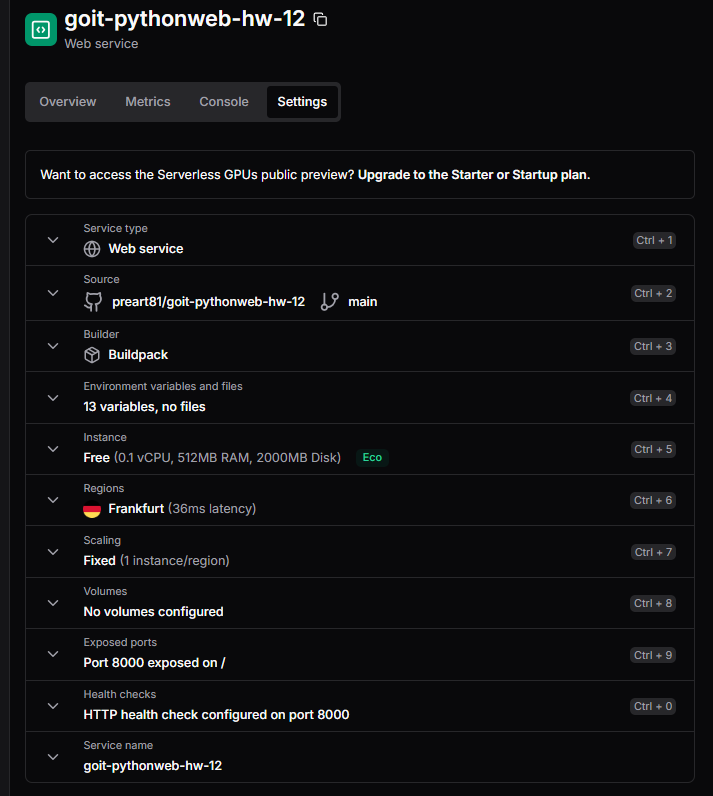
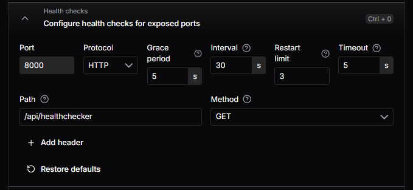
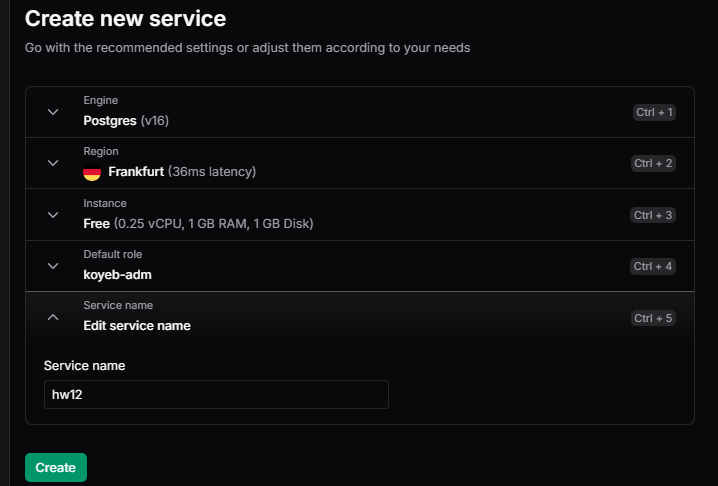

# Зберігання та управління контактами

## Клонуємо попередню версію

Клонуємо попередню версію застосунку і встановимо залежності

```shell
poetry install
```

## 1. Документація коду

За допомогою Sphinx створимо документацію для нашого застосунку.

- Для цього додамо в основних модулях до необхідних функцій і методів класів рядки docstrings.
- встановимо пакет Sphinx у наш проєкт у вигляді `dev`залежності.
  ```Shell
  poetry add sphinx -G dev
  ```
- Потім у корені проєкту виконаємо команду, яка після невеликого опитування \*\*створить нам директорію `docs`, у якій буде знаходитися наша документація.
  ```Shell
   sphinx-quickstart docs
  ```
- Опишимо структуру документації у файлі [docs/index.rst](docs/index.rst).
- Виконаємо команду
  ```Shell
   .\\make.bat html
  ```
- Документація сформована у файлі [docs/\_build/html/index.html](docs/_build/html/index.html)

## 2. Тестування

Для тестування використаємо фреймворк `pytest`

- Створимо [tests/conftest.py](tests/conftest.py) для налаштування та конфігурації тестів.
- Створимо безпосередньо файли тестів
  - [tests/test_integration_auth.py](tests/test_integration_auth.py)
  - [tests/test_integration_contacts.py](tests/test_integration_contacts.py)
  - [tests/test_unit_repository_contacts.py](tests/test_unit_repository_contacts.py)
- Запустимо тести з кореня проекту

  ```shell
  pytest -vs tests
  ```

  

- Для перевірки рівня покриття тестами використаємо `pytest-cov`
  ```shell
  poetry add pytest-cov
  pytest --cov=src tests/ --cov-report=html
  ```
  Остання команда генерує інтерактивний html-звіт покриття тестами.
- Файли для аналізу покриття можна налаштувати в [pyproject.toml](pyproject.toml) [Specifying source files
  ](https://coverage.readthedocs.io/en/latest/source.html#source)  
   

## 3. Кешування з Redis

- Щоб працювати з Redis із Python, потрібно встановити один із пакетів для роботи, наприклад redis:
  ```shell
  poetry add redis
  ```
- розгорнемо докер-контейнер наступною командою в терміналі.

```shell
docker run --name redis-cache -d -p 6379:6379 redis
```

- Для контролю терміну дії кешу використаємо модуль
  ```shell
  poetry add redis-lru
  ```
- Для кешування функції `get_current_user` з модуля [src/services/auth.py](src/services/auth.py):

  - імпортуємо модулі

  ```Py
  import redis
  from redis_lru import RedisLRU
  ```

  - налаштуємо кешування з ttl=15хв

  ```Py
  client = redis.StrictRedis(host="localhost", port=6379, password=None)
  cache = RedisLRU(client, default_ttl=15 * 60)
  ```

  - перед запитом в БД перевіряємо чи користувач в кеші і повертаємось з функції без запиту

  ```Py
    # кешування
    cache_key = f"user:{username}"
    cached_user = cache.get(cache_key)
    if cached_user:
        # print("cached_user")
        return cached_user
  ```

  - якщо запит був виконанний - оновлюємо кеш

  ```py
    # оновлення кешу
    cache.set(cache_key, user)

    return user
  ```

## 4. Скидання пароля

Реалізуємо відновлення пароля за таким алгоритмом:

1. Користувач запитує скидання пароля, вказуючи свою адресу електронної пошти

```py
@router.post("/reset_password")
async def reset_password(
    body: RequestEmail,
    background_tasks: BackgroundTasks,
    request: Request,
    db: Session = Depends(get_db),
):
```

2. Сервер генерує унікальний токен скидання пароля та надсилає лист із посиланням на скидання пароля на адресу електронної пошти користувача. Посилання вмикає маркер скидання пароля як параметр.

3. Коли користувач натискає на посилання скидання пароля, він потрапляє на API зміни пароля.

```Py
@router.patch("/update_password/{token}")
async def update_password(
    token: str,
    new_password: str,
    db: Session = Depends(get_db),
):
```

4. Користувач вводить новий пароль.

5. Якщо токен вірний, сервер оновлює пароль користувача та повідомляє про це користувача.

## 5. Керування ролями

Реалізуємо для користувачів застосунку доступ за ролями:

- `user`
- `admin`

Тільки адміністратори зможуть самостійно змінювати свій аватар за замовчуванням.

- додаємо ролі в моделі [src/database/models.py](src/database/models.py)

  ```Py
  class UserRole(str, enum.Enum):
      """
      Enum representing the roles of a user.
      """

      ADMIN = "admin"
      USER = "user"
  ```

  - додаємо роль користувачу
    ```Py
    class User(Base):
      ...
      role = Column(
          SqlEnum(UserRole, create_type=True),
          name="role",
          default=UserRole.USER,
          nullable=False,
      )
    ```

- створюємо міграцію

```shell
alembic revision --autogenerate -m 'add user roles'
```

- тепер відредагуємо міграцію, щоб коректно створився наш enum тип даних в базі

  ```Py
  def _create_user_role_type() -> None:
      """
      Функція створення кастомного типу для ролей користувачів
      """
      return sa.Enum("ADMIN", "USER", name="userrole")


  def upgrade() -> None:
      # створення нового типу для ролей користувачів
      userrole = _create_user_role_type()
      userrole.create(op.get_bind())
      # додаємо новий стовпець до таблиці users
      op.add_column(
          "users", sa.Column("role", userrole, server_default="USER", nullable=False)
      )
      # ### commands auto generated by Alembic - please adjust! ###
      # op.add_column('users', sa.Column('role', sa.Enum('ADMIN', 'USER', name='userrole'), nullable=True))
      # ### end Alembic commands ###


  def downgrade() -> None:
      # ### commands auto generated by Alembic - please adjust! ###
      op.drop_column("users", "role")
      # ### end Alembic commands ###
      # видаляємо тип userrole
      userrole().drop(op.get_bind())
  ```

- застосовуємо міграцію

```shell
alembic upgrade head
```

- додамо функцію перевірки чи має користувач права адміністратора
  [src/services/auth.py](src/services/auth.py)

  ```py
  def get_current_admin_user(current_user: User = Depends(get_current_user)):
      """
      Checks if the current user is an admin.

      """
      if current_user.role != UserRole.ADMIN:
          raise HTTPException(
              status_code=status.HTTP_403_FORBIDDEN,
              detail="The user does not have enough privileges",
          )
  ```

- змінимо маршрут `/avatar` в [src/api/users.py](src/api/users.py), щоб він працював тільки для адміністраторів

```py
@router.patch("/avatar", response_model=User)
async def update_avatar_user(
    file: UploadFile = File(),
    # user: User = Depends(get_current_user),
    user: User = Depends(get_current_admin_user),
    db: AsyncSession = Depends(get_db),
):
```

## 6. Збереження конфіденційних даних

Конфіденційні дані та налаштування зберігаємо у файлі `.env`, який не включаємо до репозиторію.
Приклад файла збережемо у [.env.example](.env.example)

## 7. Контейнеризація

## Розгортання у хмарі

Для розгортання у хмарі використаємо [Koeb](https://www.koyeb.com/)

- підключаємо сервіс до GitHub
- обираємо репозиторій
- налаштовуємо оточення з нашого файлу `.env`  
  
- налаштовуємо health chek
  
- створюємо БД
  
- змінну оточення `DB_URL` налаштовуємо для роботи із створеною БД

## Запуск

Щоб запустити програму FastAPI для розробки, можна використати `fastapi dev` команду:

    fastapi dev main.py

Або, щоб більш гнучко налаштовувати запуск, можна виконати наступну команду, щоб запустити сервер `FastAPI` з `uvicorn`:

    uvicorn main:app --host localhost --port 8000 --reload

Тут параметри команди мають наступне значення:

- `uvicorn` — високопродуктивний вебсервер ASGI;
- `main` — файл `main.py`;
- `app` — об'єкт, повернений після запиту `app = FastAPI()`;
- `-host` — дозволяє прив'язати сокет до хосту. Значення за замовчуванням — `127.0.0.1`;
- `-port` — дозволяє прив'язати сокет до певного порту. За замовчуванням використовується значення `8000`;
- `-reload` — забезпечує гаряче перезавантаження сервера під час розробки.
