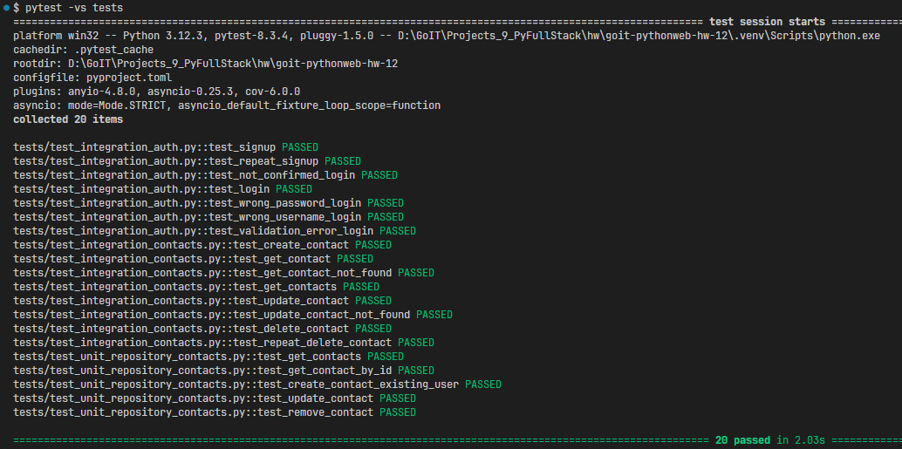

# Зберігання та управління контактами

## Клонуємо попередню версію

Встановимо залежності

```shell
poetry install
```

src\database\models.py

- додаємо клас User
- і залежність user в клас Contact
- якщо ми створили нову базу даних - спочатку застосуємо готові міграції
  ```shell
  alembic upgrade head
  ```
- створюємо міграцію наступною консольною командою в корені проєкту:
  ```Shell
  alembic revision --autogenerate -m 'add user'
  ```
  > Саме оточення alembic ініціалізовано в попередньому проекті
  > Ініціалізуємо оточення `alembic` з підтримкою асинхронності `-t async`
  >
  > ```shell
  > alembic init -t async alembic
  > ```
- Якщо файл з міграцією успішно створився в директорії migrations/versions, то застосуємо створену міграцію:
  ```shell
  alembic upgrade head
  ```
- перевіримо що поля і таблиця User створені:  
  

- створюємо схему валідації для users  
  [src/schemas/users.py](src/schemas/users.py)

- створюємо репозиторій для users
  [src/repository/users.py](src/repository/users.py)

## Додаємо сервіс автентифікації та користувача

Для правильної роботи нашого сервісу необхідно встановити наступні пакети:

```shell
    poetry add python-jose["cryptography"]
    poetry add passlib["bcrypt"]
```

- додаємо параметри `jwt` в [src/conf/config.py](src/conf/config.py)
- додаємо код сервісу [src/services/users.py](src/services/users.py)
- додаємо код сервісу [src/services/auth.py](src/services/auth.py)

## Додаємо маршрути автентифікації та користувача

- Створимо маршрути [src/api/auth.py](src/api/auth.py) та додамо:
  - `/api/auth/register` — маршрут для реєстрації користувача;
  - `/api/auth/login` — маршрут для входу користувача;
- підключити нові роутери у головному файлі застосунку `main.py`

## Додаємо авторизацію

- У модель User необхідно додати поле `confirmed = Column(Boolean, default=False)`. Це логічний вираз, що визначає, чи був підтверджений email користувача.
- Після цього необхідно виконати міграції для зміни таблиці користувача.
  ```shell
  alembic revision --autogenerate -m 'add to model User filed confirmed'
  ```
- Та застосувати їх.

  ```shell
  alembic upgrade head
  ```

- додамо в репозиторій [src/repository/contacts.py](src/repository/contacts.py) додатковий параметр user: User. Це дозволяє нам виконувати операції в контексті автентифікованого користувача. У кожному методі ми оновили SQLAlchemy-запити, щоб вони враховували контекст користувача. Це гарантує, що користувачі можуть взаємодіяти лише зі своїми конатктами.

## Додаємо ratelimit

Обмежимо кількість запитів до маршруту користувача `/me`

- додаємо ліміти в [src/api/users.py](src/api/users.py) і огортаємо /me декоратором

  ```py
  limiter = Limiter(key_func=get_remote_address)

  @router.get("/me", response_model=User)
  @limiter.limit("5/minute")
  async def me(request: Request, user: User = Depends(get_current_user)):
      return user
  ```

- додаємо обробник винятків у [main.py](main.py)
  ```Py
  @app.exception_handler(RateLimitExceeded)
  async def rate_limit_handler(request: Request, exc: RateLimitExceeded):
      return JSONResponse(
          status_code=429,
          content={"error": "Перевищено ліміт запитів. Спробуйте пізніше."},
      )
  ```

## Вмикаємо CORS

Для використання CORS у FastAPI ми імпортуємо `CORSMiddleware` з пакета `fastapi`:

```Py
from fastapi import FastAPIfrom fastapi.middleware.cors import CORSMiddleware
```

Створюємо екземпляр застосунку:

```Py
app = FastAPI()
```

Визначаємо список доменів, які можуть надсилати запити до нашого API:

```Py
origins = [ "<http://localhost:3000>" ]
```

Додаємо `CORSMiddleware` у наш застосунок:

```Py
app.add_middleware( CORSMiddleware, allow_origins=origins, allow_credentials=True, allow_methods=["*"], allow_headers=["*"],)
```

## Реалізуємо можливість оновлення аватара користувача

Використаємо сервіс Cloudinary.
Реєструємось на сервіс [Cloudinary](https://cloudinary.com/).
Отримані ключі записуємо в [.env](.env)

```ini
# Cloudinary
# CLOUDINARY_NAME
CLD_NAME=name
# CLOUDINARY_API_KEY
CLD_API_KEY=12345678
# CLOUDINARY_API_SECRET
CLD_API_SECRET=secret
```

Розширимо наш клас конфігурації `Settingns` новими змінними [src/conf/config.py](src/conf/config.py).

```Py
class Settings(BaseSettings):
    DB_URL: str
    JWT_SECRET: str
    JWT_ALGORITHM: str = "HS256"
    JWT_EXPIRATION_SECONDS: int = 3600

    MAIL_USERNAME: str
    MAIL_PASSWORD: str
    MAIL_FROM: str
    MAIL_PORT: int
    MAIL_SERVER: str
    MAIL_FROM_NAME: str
    MAIL_STARTTLS: bool = False
    MAIL_SSL_TLS: bool = True
    USE_CREDENTIALS: bool = True
    VALIDATE_CERTS: bool = True
    TEMPLATE_FOLDER: Path = Path(__file__).parent.parent / "services" / "templates"

    CLD_NAME: str
    CLD_API_KEY: int
    CLD_API_SECRET: str

    model_config = ConfigDict(
        extra="ignore", env_file=".env", env_file_encoding="utf-8", case_sensitive=True
    )
```

Визначимо новий маршрут для завантаження аватарок `/avatar` і помістимо його у файл [src/api/users.py](src/api/users.py)

Опишемо сервіс завантаження файлу у хмару `UploadFileService`, який помістимо у [src/services/upload_file.py](src/services/upload_file.py)

Додамо наступний метод у сервіс користувача `UserService` з [src/services/users.py](src/services/users.py):

```Py
    async def update_avatar_url(self, email: str, url: str):
        return await self.repository.update_avatar_url(email, url)
```

Далі додамо метод `update_avatar_url` у репозиторій користувача [src/repository/users.py](src/repository/users.py), який оновлює аватар користувача в базі даних:

```Py
    async def update_avatar_url(self, email: str, url: str) -> User:
        user = await self.get_user_by_email(email)
        user.avatar = url
        await self.db.commit()
        await self.db.refresh(user)
        return user
```

Нові аватари завантажуються на Cloudinary і посилання на зображення у хмарі записується в базу даних `users.avatar`

## Запуск

Щоб запустити програму FastAPI для розробки, можна використати `fastapi dev` команду:

    fastapi dev main.py

Або, щоб більш гнучко налаштовувати запуск, можна виконати наступну команду, щоб запустити сервер `FastAPI` з `uvicorn`:

    uvicorn main:app --host localhost --port 8000 --reload

Тут параметри команди мають наступне значення:

- `uvicorn` — високопродуктивний вебсервер ASGI;
- `main` — файл `main.py`;
- `app` — об'єкт, повернений після запиту `app = FastAPI()`;
- `-host` — дозволяє прив'язати сокет до хоста. Значення за замовчуванням — `127.0.0.1`;
- `-port` — дозволяє прив'язати сокет до певного порту. За замовчуванням використовується значення `8000`;
- `-reload` — забезпечує гаряче перезавантаження сервера під час розробки.
