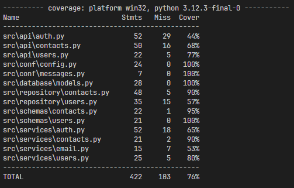

# Зберігання та управління контактами

## Клонуємо попередню версію

Клонуємо попередню версію застосунку і встановимо залежності

```shell
poetry install
```

## 1. Документація коду

За допомогою Sphinx створимо документацію для нашого застосунку.

- Для цього додамо в основних модулях до необхідних функцій і методів класів рядки docstrings.
- встановимо пакет Sphinx у наш проєкт у вигляді `dev`залежності.
  ```Shell
  poetry add sphinx -G dev
  ```
- Потім у корені проєкту виконаємо команду, яка після невеликого опитування \*\*створить нам директорію `docs`, у якій буде знаходитися наша документація.
  ```Shell
   sphinx-quickstart docs
  ```
- Опишимо структуру документації у файлі [docs/index.rst](docs/index.rst).
- Виконаємо команду
  ```Shell
   .\\make.bat html
  ```
- Документація сформована у файлі [docs/\_build/html/index.html](docs/_build/html/index.html)

## 2. Тестування

Для тестування використаємо фреймворк `pytest`

- Створимо [tests/conftest.py](tests/conftest.py) для налаштування та конфігурації тестів.
- Створимо безпосередньо файли тестів
  - [tests/test_integration_auth.py](tests/test_integration_auth.py)
  - [tests/test_integration_contacts.py](tests/test_integration_contacts.py)
  - [tests/test_unit_repository_contacts.py](tests/test_unit_repository_contacts.py)
- Запустимо тести з кореня проекту

  ```shell
  pytest -vs tests
  ```

  

- Для перевірки рівня покриття тестами використаємо `pytest-cov`
  ```shell
  poetry add pytest-cov
  pytest --cov=src tests/ --cov-report=html
  ```
  Остання команда генерує інтерактивний html-звіт покриття тестами.
- Файли для аналізу покриття можна налаштувати в [pyproject.toml](pyproject.toml) [Specifying source files
  ](https://coverage.readthedocs.io/en/latest/source.html#source)  
   

## 3. Кешування з Redis

- Щоб працювати з Redis із Python, потрібно встановити один із пакетів для роботи, наприклад redis:
  ```shell
  poetry add redis
  ```
- розгорнемо докер-контейнер наступною командою в терміналі.

```shell
docker run --name redis-cache -d -p 6379:6379 redis
```

- Для контролю терміну дії кешу використаємо модуль
  ```shell
  poetry add redis-lru
  ```
- Для кешування функції `get_current_user` з модуля [src/services/auth.py](src/services/auth.py):

  - імпортуємо модулі

  ```Py
  import redis
  from redis_lru import RedisLRU
  ```

  - створимо декоратор для кешування протягом 15хв

  ```Py
  client = redis.StrictRedis(host="localhost", port=6379, password=None)
  cache = RedisLRU(client, default_ttl=15 * 60)
  ```

  - Огорнемо нашу функцію декоратором

  ```Py
  @cache
  async def get_current_user(...
  ```

## 6. Збереження конфіденційних даних

Конфіденційні дані та налаштування зберігаємо у файлі `.env`, який не включаємо до репозиторію.
Приклад файла збережемо у [.env.example](.env.example)

## Запуск

Щоб запустити програму FastAPI для розробки, можна використати `fastapi dev` команду:

    fastapi dev main.py

Або, щоб більш гнучко налаштовувати запуск, можна виконати наступну команду, щоб запустити сервер `FastAPI` з `uvicorn`:

    uvicorn main:app --host localhost --port 8000 --reload

Тут параметри команди мають наступне значення:

- `uvicorn` — високопродуктивний вебсервер ASGI;
- `main` — файл `main.py`;
- `app` — об'єкт, повернений після запиту `app = FastAPI()`;
- `-host` — дозволяє прив'язати сокет до хосту. Значення за замовчуванням — `127.0.0.1`;
- `-port` — дозволяє прив'язати сокет до певного порту. За замовчуванням використовується значення `8000`;
- `-reload` — забезпечує гаряче перезавантаження сервера під час розробки.
